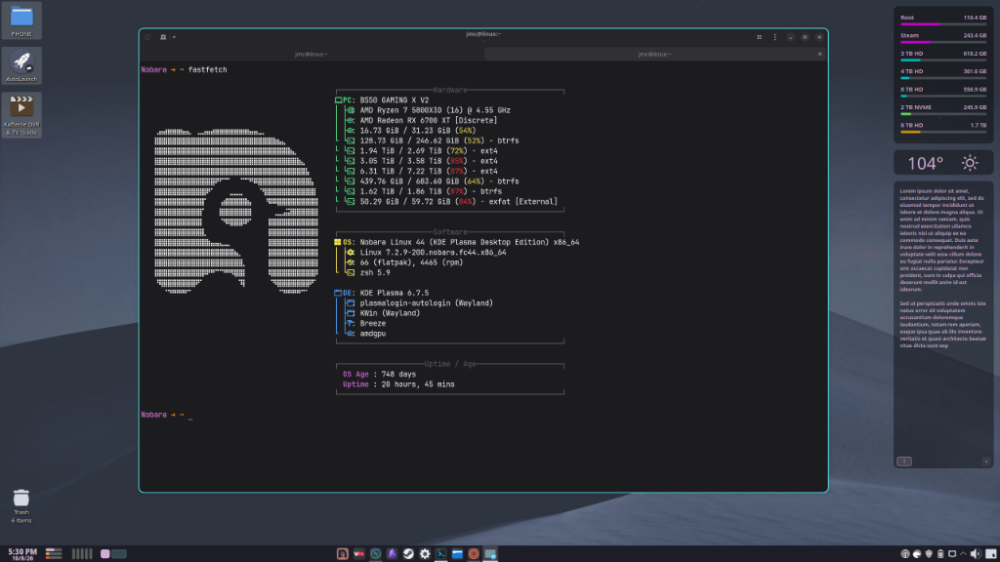
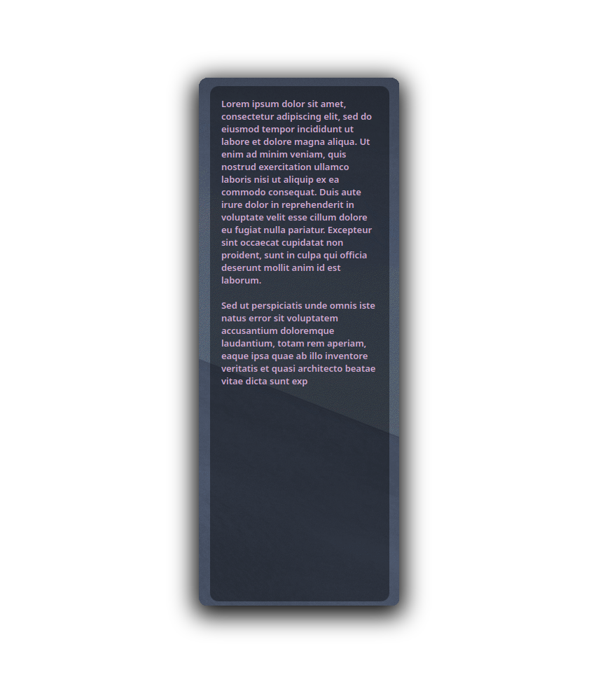
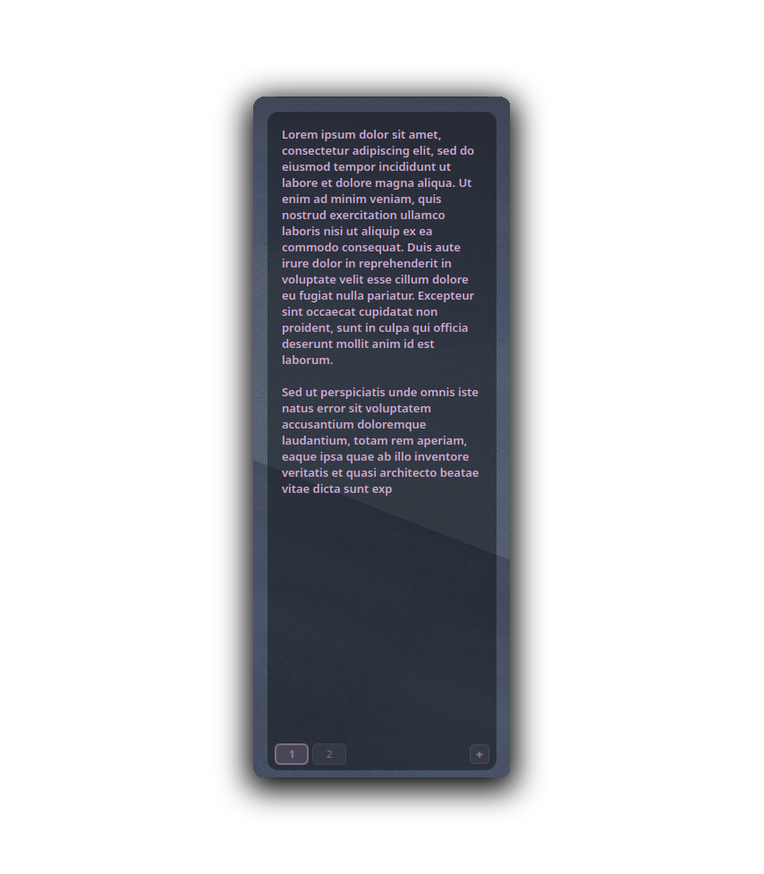
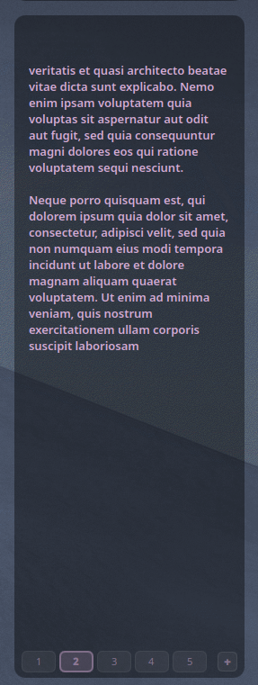
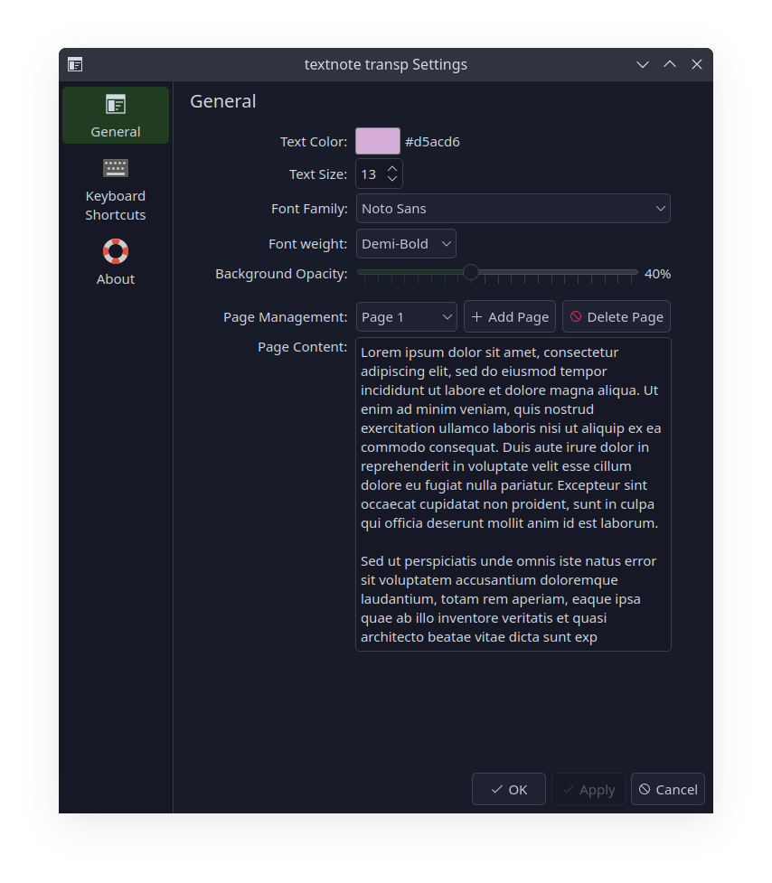

# Transparent Text Note Widget

[](https://kde.org/plasma-desktop/)
[](https://doc.qt.io/qt-6/qtqml-index.html)
[](https://github.com/PlasmaDrifter)
[](LICENSE)

A transparent sticky note widget for KDE Plasma 6 that blends seamlessly into any wallpaper.

---

## Previews



### Screenshots

| Single Page (Clean View) | Two Pages Navigation |
| :---: | :---: |
|  |  |
| **Multi-Page Note (5 Pages)** | **Configuration Settings** |
|  |  |

---

## Features

- **Transparent**: Minimalist background with zero card borders and customizable opacity
- **Multi-Page Notes**: Easily create and switch across multiple note pages
- **Clean Single-Page Mode**: Page indicator automatically hides when only 1 page exists
- **Keyboard Shortcuts**: Rapid page navigation using `Alt + Left/Right` or `Alt + PgUp/PgDown`
- **Click-to-Type**: Click anywhere in the empty space below existing text to start typing
- **Auto-Saving**: Automatic persistence across system restarts and reboots
- **Customizable**: Text color, font size, font family, font weight, and background opacity
- **Scrollable Configuration**: Settings dialog features full vertical scrollbar support for viewing and editing long notes

## Requirements

- **Environment**: KDE Plasma 6.0 or higher
- **Framework**: Qt6 QML / Plasma Applet API

## Installation

### Option 1: Git Clone (Recommended)
```bash
mkdir -p ~/.local/share/plasma/plasmoids/
git clone https://github.com/PlasmaDrifter/Widget-textnote.transp.git ~/.local/share/plasma/plasmoids/local.widget.textnote.transp
```

### Option 2: Plasma Package Installer
```bash
kpackagetool6 -i ~/.local/share/plasma/plasmoids/local.widget.textnote.transp
```

Then right-click your desktop or panel $\rightarrow$ **Add Widgets...** and search for the widget name.

## Credits & License

- **Author / Maintainer**: PlasmaDrifter
- **License**: Licensed under the [GPL-2.0+](LICENSE).

---

## Community & Discussions

Got questions, setup ideas, or feedback?

* Join our subreddit at [**r/PlasmaDrifterProjects**](https://reddit.com/r/PlasmaDrifterProjects) to discuss updates, get support, and share configurations.
